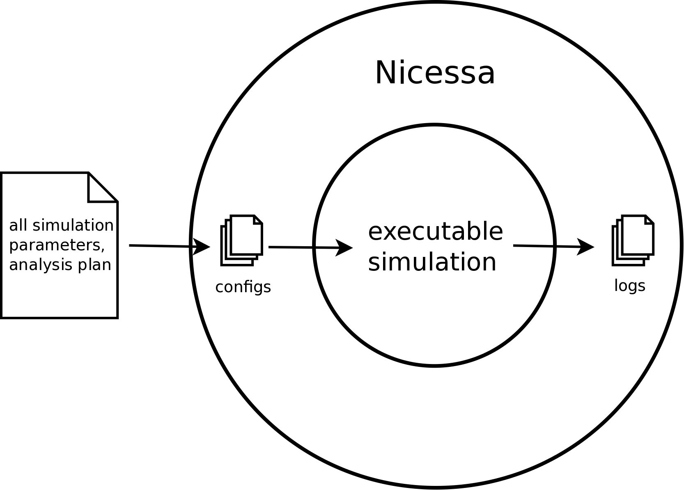

Welcome to StoSim's documentation!
====================================

StoSim is a light-weight framework for parameterised stochastic simulations. The researcher provides the simulation code (written in the programming language of his/her choice), 
but StoSim takes over a lot of tedious work from there on. StoSim can

  * create all necessary computation jobs (from lists of parameter settings)
  * execute these jobs on available CPUs (only your computer, the local network or PBS computation cluster)
  * handle stochastic repetition of settings and seeding of randomness (for repeatable experiments) 
  * analyse the results with graphical plots and T-tests (it is easy to analyse results made with specific parameter settings)
  * back up code and results (to be able to go back to important milestones)

StoSim is easy to get started with: By only writing one configuration file, your simulation is parameterised and jobs are distributed on available CPUs on your computer. When all jobs are done, paper-ready plots as well as T-tests are being created (see :ref:`basic_example`). All your code needs to do to work with StoSim is to read a set of parameters from a config file and write its output log into a file which StoSim provides.

StoSim is developed under an open-source MIT license at the CWI Amsterdam and written in Python (but, I repeat, the simulation code can be written in any programming language). Find the `code at github <https://github.com/nhoening/stosim/>`_ It makes use of open-source industry standards like Unix screens, PBS job schduling, rsync, Gnuplot and Gnu R.
While it proves very useful for its current small userbase, there is still lots of things to do even better (see `the Ticket tracker <http://www.github.com/nhoening/stosim/issues?state=open>`_) and a lot of great ideas to go from here. Let me know if you have ideas or want to contribute.

Please contact `Nicolas Höning <nicolas@cwi.nl>`_ with any questions or problems.

There also is a `PDF version <StoSim.pdf>`_ of this documentation

******************
Narrative contents
******************

.. toctree::
    :maxdepth: 2

    qa/what.rst
    qa/which.rst
    qa/workflows.rst
    qa/get.rst
    qa/usage.rst
    qa/underthehood.rst
    qa/depend.rst

.. image:: img/stosim-workflows.png
    :align: center
..    :scale: 40%

***************
Tutorials
***************

.. toctree::

    tut/basic.rst
    tut/sub.rst
    tut/stochastic.rst
    tut/remote.rst
    tut/custom.rst

************************
Configuration reference
************************

.. toctree::

    reference.rst

******************
Code documentation
******************

There is a detailled documentation of all internal modules and functions:

.. toctree::

    code.rst

    
.. Indices and tables
.. ==================

.. * :ref:`genindex`
.. * :ref:`modindex`
.. * :ref:`search`

