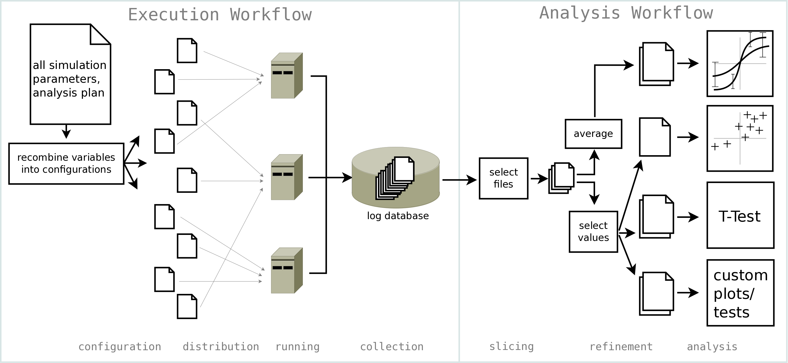

.. Nicessa documentation master file, created by
   sphinx-quickstart on Sat Jan  1 02:59:39 2011.
   You can adapt this file completely to your liking, but it should at least
   contain the root `toctree` directive.

Welcome to Nicessa's documentation!
==================================
These pages will hopefully be of help to learn about Nicessa.
However, this is still ongoing work. 
If you find something missing or unclear, please contact the maintainer of this project.

******************
Narrative contents
******************

.. toctree::
    :maxdepth: 2

    qa/what.rst
    qa/which.rst
    qa/workflows.rst
    qa/get.rst
    qa/usage.rst
    tut/tutorials.rst
    qa/underthehood.rst
    qa/depend.rst
    tut/custom.rst

************************
Configuration reference
************************

.. toctree::

    reference.rst

******************
Code documentation
******************

There is a detailled documentation of all internal modules and functions:

.. toctree::

    code.rst

    
.. Indices and tables
.. ==================

.. * :ref:`genindex`
.. * :ref:`modindex`
.. * :ref:`search`

