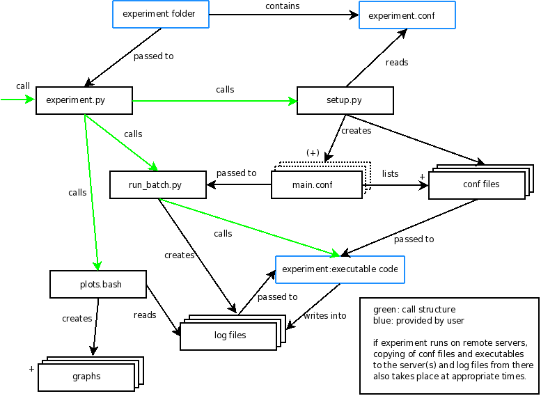

.. _underthehood:

In a nutshell: What is happening under the hood?
=========================================

Nicessa is configures by one configuration file which is expected to be found in
your experiment folder. It is given an entry point to run 
an actual executable. Nicessa wants control over log files (to use them later),
so it creates them and tells the executable where to write log data to.
The log files are then later used by Nicessa to produce figures and tests.
 
Here is a more detailled picture of what is going under the hood:

