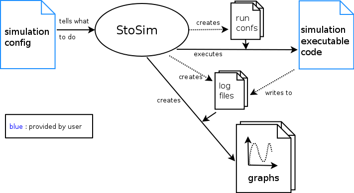

.. _what:

What is it?
=================
When running stochastic simulations, there is a recurring set of technical 
tasks: Variable settings need to be recombined, log files need to be managed, and the results need to be
analysed graphically and statistically. In addition, the computational load should be distributed over
several computers.

StoSim is a light-weight simulation framework, which relieves the researcher of these technical tasks 
in the executive and analytical workflows, while being non-intrusive with respect to the actual implementation of the simulation model. 

In short:

StoSim runs your stochastic simulation(s) for you. 
You write the actual simulation, but stosim relieves you of:

  * arranging runs for all combinations of your parameters
  * distributing workload on different machines (in your network or on a PBS cluster)
  * generating nice paper-ready plots from the results
  * running T-tests

From you StoSim only needs:
    
  * An executable to perform a typical run of your simulation
  * A configuration file, so StoSim knows about your simulation: where the code is, which parameter settings you want to use
    and what of the result data you want to plot or test statistically.

It is in particular targeting the class of simulations which are *stochastic* (in that the research 
problem has a probabilistic nature) and *combinatorial* (in that complexity makes the analysis of many parameter settings necessary to answer research questions).

StoSim has been developed at the Vrije Universiteit Amsterdam and the CWI Amsterdam, where it has been 
used for several publications and extended with feedback. It is open-source and extensively documented. 

Maybe this broad overview helps to understand the basic notion of it:

..    :scale: 40%
 

If not, have a look at :ref:`workflows` that are covered by StoSim.

I currently run StoSim on Mac OSX and on Linux. Windows would need some work. See :ref:`depend` for more details.
 
