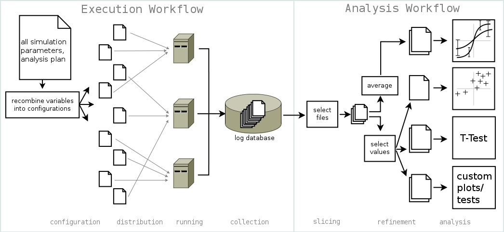

.. _workflows:

=================
The Workflows
=================

StoSims workflow can be described as the concatenation of two smaller workflows: 
Simulations are first being executed and then analysed (see Figure below). 
Several sub-simulations can be described, with each of them performing one execution 
workflow and as many analysis workflows as needed.

We'll describe both of them here in detail. If you really need to get started,
head right over to :ref:`get`, :ref:`usage` and :ref:`basic_example`.

    The workflows of StoSim: Execution and Analysis

Execution
------------

The object of the execution workflow is one *configuration*, which is one of the possible combination of parameter settings. 
You describe your simulation to StoSim by listing all parameters and the possible settings for them. 
In addition, you point it to an executable which starts a run of her simulation. 
StoSim will create one configuration file for every possible combination of these settings. 

For each configuration, StoSim will call the executable ``n`` times with each of these configuration files, 
where ``n`` can be set by you as well. For every ``n``, a fixed seed can be provided, to ensure reproducibility 
of randomised results. In addition to the configuration file, the executable receives the name of a log file, 
to write result data into. It is assumed that log data is numeric and in tabular form.

If you have several CPUs available (on possibly more than one computer), StoSim will *distribute* the configuration 
files among them, so that they will be *running* in parallel. When all runs have finished, all result files will be 
*collected* in one local folder. The control over the location and naming of log files makes the analysis workflow 
of StoSim possible, because it indexes all log files with the parameter settings under which they have been created.

It is possible to extend the 'database' of log files by repeating the execution workflow, adding more runs for a 
selectable subset of all configurations.

Analysis
----------

The object of the analysis workflow are the logfiles created by the simulation. For one analysis, you'll be interested 
in one column in the files. 

To be analysed, the collected data is first *sliced*: you describe the runs which the analysis 
should represent by parameter settings. The resulting data subset is then *refined*: one or more values can be selected 
from each file in the sliced subset (e.g. maximal value of the column) or averages 
and standard deviations can be calculated. 

The result is finally *analysed* graphically with Gnuplot or statistically 
with the Gnu R package. Out of the box, StoSim supports line plots with error bars and scatter plots (several analysis 
workflows can be conducted that each result in one plot on the same figure) and T-Tests. 
You can configure as many analyses as you need and it is possible to write custom gnuplot 
and R scripts and link them into the workflow.

