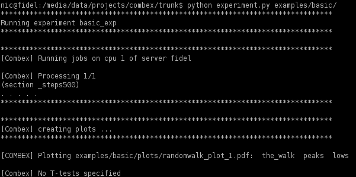
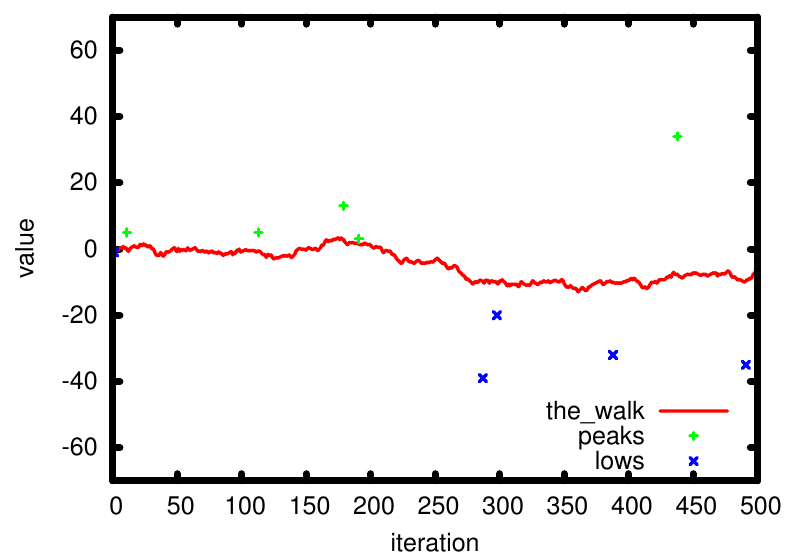

.. _basic_example:

Setting up a basic simulation
=============================

Summary
-------
In this example, we see how to make StoSim run a simulation (a simple random
walk) and generate plots from the resulting data.
This example (like the others) can be found in the ``example`` folder of 
StoSim - I made comments in the code files when appropriate, especially for 
this ``basic`` example.

The two important things to look at are the 
`configuration file <https://github.com/nhoening/stosim/raw/master/examples/basic/stosim.conf>`_ and the 
`simulation executable <https://github.com/nhoening/stosim/raw/master/examples/basic/main.py>`_.

I'll explain the most important steps here:

The basic example is a really simple simulation. We only want to simulate a random walk,
run it several times and then plot the average outcome as well as maxima and
minima for each run.
            
The Main Configuration File
---------------------------

This is the configuraton file for the basic simulation. We'll look at all parts
separately here - however, there is also a full reference of all possible
configuration settings at :ref:`main_reference`.

[meta]
^^^^^^
We first take the opportunity to note some general information about our simulation:
name and who is the maintainer.

.. literalinclude:: ../../examples/basic/stosim.conf
    :lines: 6-11

[control]
^^^^^^^^^^
We then describe how it should be run. What code should it call, how often
should each configuration run, and should we distribute the runs on other
computers. Our simulation executable is `main.py` and we'll discuss it next.
We run 5 times and are only doing it locally (we mention remote support in
:ref:`sub_example`). We also note that we use the tab delimiter ('\\t') to
separate between columns when we write log data (the default value is a 
comma, but the tab is also very common).

.. literalinclude:: ../../examples/basic/stosim.conf
    :lines: 14-22

.. note:: Your executable will run under `/bin/sh`.

[params]
^^^^^^^^
Then, we can add parameters specific to our simulation. That is, we mention 
parameters that will be used by the executable and tell StoSim to pass them 
on. This is simple in this case, 
we only specify how long our simulation should run: 500 timesteps. 

.. literalinclude:: ../../examples/basic/stosim.conf
    :lines: 24-28

.. _plot_settings:

[plot-settings] and [figure<i>]
^^^^^^^^^^^^^^^^^^^^^^^^^^^^^^^^
The rest of the configuration is spent with setting up a plot.
You can specify several figures with each one or more plots
(look out for the numbering).

We return to this below in :ref:`using_plotting` and show the 
configuration relevant to our example there.

There is also a complete reference on settings for :ref:`plot_reference`.

The Executable
--------------
Then, we need an executable. All your executable needs to do is read a configuration file StoSim hands it
and write its output into a file which StoSim names. That is **all** there is
to know about StoSim as far as your executable is concerned!

Below is the Python file from the basic example - it uses a lot of comments to explain what it is doing.

.. note:: Note that the executable doesn't have to be a Python script. All you need to provide is any 
          code that is executable (e.g. a Java, C or Perl script) and have it write its logs to the file 
          with the name provided by StoSim. 

.. literalinclude:: ../../examples/basic/main.py

.. note:: Note that we use the tab (\\t) here to separate values, just as we told StoSim above.

.. note:: Note also that you can write comments in the logs (here: first line).
          Be sure to indicate comments with a starting '#'

.. _using_plotting:

Using the data: Making Plots
------------------------------

So we have now an simulation and it gets run by StoSim and it writes to log files. What do we do with them? Let's make
nice graphs! StoSim organizes all its log files in the ``data`` folder. For each configuration, log files are put into a subfolder whose name
contains all parameter settings. We have only one possible setting now, so in ``examples/basic/data`` we now find the folder 
``_steps500``, containing five log files (Why five? We told StoSim to run each setting five times in the configuration).

.. note:: You could add further runs to your data. Use the ``--more`` command to add to your current data collection (see the example :ref:`stochastic_example`).

General plot-settings
^^^^^^^^^^^^^^^^^^^^^
General settings of plots can be in the main configuration file or, for convenience, 
be put into the subsimulation files (see the next example :ref:`sub_example`).
Those settings can also be set per figure. Settings per figure overwrite
plot-settings in subsimulations, which overwrite the plot-settings in the main
configuration.

The first four settings are of purely cosmetic nature, while the fifth is
really interesting when we discuss line plots below - in essence, we're telling
StoSim here not to draw vertical error bars.

.. literalinclude:: ../../examples/basic/stosim.conf
    :lines: 30-37

Settings per figure
^^^^^^^^^^^^^^^^^^^
Let's first look at the settings per figure:
``name``, ``x-label`` and ``y-label`` seem obvious.
The ``y-range`` setting is dependent on what values you expect or want to see on the y-axis. 
We set the ``xcol`` to 1, since we wrote the step number in column 1 and the values in column 2.

.. note:: Note that all plots in each figure use the same x-axis.

.. literalinclude:: ../../examples/basic/stosim.conf
    :lines: 38-49

There can be many figures, each having one or more plots (numerate the options consistently, i.e. figure1, figure2, figure3 and plot1, plot2, plot3).

Settings per plot
^^^^^^^^^^^^^^^^^^

Now pay attention to the plots descriptions, where each dataset which is plotted on the figure is described.
StoSim can do two kinds of plots for you, line- and scatterplots, both of which are used in the example below.

.. literalinclude:: ../../examples/basic/stosim.conf
    :lines: 50-

Settings to narrow down data
"""""""""""""""""""""""""""""

For each plot, you can specify name-value pairs (where the names refer to parameter names from the
``params`` section (see above). With this, you narrow down the dataset used for making the plot and this is also why StoSim puts all parameter settings 
in the data folder names containing the log files, so it can easily pick the ones it needs to collect data from. 

In the current example figure, we have only one parameter (``steps``) with only one setting (``500``) - we could add ``steps:500`` to the plot descriptions but that would still 
select all five files and thus change nothing. Thus, we do not use this feature in this example - 
we plot data from all five files we generated.
The next example (see :ref:`sub_example`) is a little bit more sophisticated in this regard.

StoSim-specific settings
""""""""""""""""""""""""""

In addition to that, there are stosim-specific settings per plot (to set them
apart from parameters, they all start with an underscore). 

  * ``_name`` (Required) Each plot needs a name to identify it on the figure.
  * ``_type`` (Required) StoSim currently supports two plot types - line and scatter. We'll
    use both of them in a minute. 
  * ``_ycol`` (Required) This number indicates which column of your log files should be plotted on the y-axis. We wrote the values in column 2,
    so we take column 2 here as the y xolumn. 
  * ``_select`` This refers to a method to pick specific valued from the log
    files. We also used this in our figure, so we'll discuss it below.

Selecting type and data
^^^^^^^^^^^^^^^^^^^^^^^

StoSim supports two types of plots and they both differ in their approach to
data selection and preparation.

If you tell stosim to produce a ``line`` plot, it will average over all log files that are in matched data-folders
and show the averages on a line.
While doing so, it can automatically add error bars to the plot, showing the standard deviation in the data. This is
the ``use-y-errorbars`` - setting which is for this example set to 0 (meaning
no, where 1 would mean yes).

If you tell StoSim to produce a ``scatter`` plot, it will merely put all <x,y> data points on the figure. The interesting
part is that you may want to select certain data points instead of plotting all
of them (we already produce 5 * 500 = 25000 points in this example). We use the
optional ``_select``  directive here to say that for each run StoSim made on our
simulation, we want to select only one value - the maximal number which the
random walk encountered and also the minimal (before you ask, StoSim currently
has ``max-x``, ``max-y``, ``min-x``, ``min-y`` and ``last``. More are possible
and I certainly want custom selectors).

Let's now run the simulation with
    
    ``$ stosim --folder examples/basic/``

This is what I see on the terminal:

    The terminal during a run of the basic example

You should now find a folder called ``data/_steps500``. There, all the log files
have been written. The folder name ``_steps500`` indicates the parameter settings
used in those runs (and in this simple example, we only have parameter with one
setting).

Here is the plot which should be found in the ``examples/basic/plots`` directory if everything went well:

    The plot created by the basic example

So we note that the average of five runs is visible between 10 and -10, but the actual maxima and minima
range between 40 and -40, respectively. Otherwise, this example is not very useful scientifically :)
Feel free to play with it. One could increase the number of runs to see the effect on
the line. We will do that when we return to the random-walk example to discuss
:ref:`stochastic_example`.

This concludes the first tutorial - I hope it helped a little to explain how to use StoSim.
 
