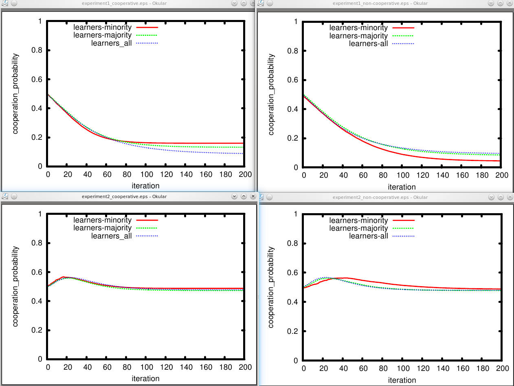

.. _sub_example:

====================
Using subsimulations
====================

Summary
-------
In this example, we use sub-simulations and plot different parts of
the data set against each other.

Describing Subsimulations
-------------------------
To use subsimulations means that you run different simulations 
which differ in specific sets of parameters.
There are often situations where this is a good approach.
Sometimes just because it structures your process, sometimes for technical
reasons. We use a good example for a technical reason here: Two simulations
that use different implementations of the `Prisoners Dilemma
<http://en.wikipedia.org/Prisoner's_Dilemma>`_. Such a dilemma is described by
four parameter settings and here, we do not want all of the possible combinations 
between the two dilemmas (4*4=16). We want only two combinations - 
the two dilemmas.

To describe subsimulations, you can have some more ``.conf`` files next to ``stosim.conf``, one for each simulation.
In those, you can specify parameter settings that only hold in those simulations. Subsimulations inherit
settings from the main configuration `stosim.conf <https://github.com/nhoening/StoSim/raw/master/examples/subsim/stosim.conf>`_ and their settings overwrite
settings there. The *subsim* example mentions its subsimulations in
``stosim.conf`` in a section called ``[simulations]``, like so:

.. literalinclude:: ../../examples/subsim/stosim.conf

.. note:: We als have some more parameter settings than in the basic example.
          ``n`` is the number of agents, ``ratio_learning`` indicates how many agents
          will change their likelihood to cooperate based on their experiences and
          ``mean_coop`` is the mean likelihood to cooperate of the
          (non-learning) agents.
          Have a look in `the executable for this simulation
          <https://github.com/nhoening/StoSim/raw/master/examples/subsim/main.py>`_ to see what the simulation is doing
          exactly. Basically, we are interested in the likelihood to
          cooperate which the learning agents will arrive at (they start
          at around 0.5).
          The second dilemma (in ``sim2.conf``) is technically not a Prisoners Dilemma.
          I just played with the numbers to see how the very very simple 
          learning algorithm I used behaves when in the dilemma temptation
          and reward (as well as penalty and suckers' payoff) are the same. 

In this case, we need to provide the configuration files
`sim1.conf <https://github.com/nhoening/StoSim/raw/master/examples/subsim/sim1.conf>`_ and 
`sim2.conf <https://github.com/nhoening/StoSim/raw/master/examples/subsim/sim2.conf>`_. Note that we left out the
``.conf``-extension when we mentioned them.

In the subsimulations, we define a unique subset of settings in their own ``[params]`` - section.
This is where we describe the different outcomes of interactions (payoff-wise) 
in our two versions of the Prisoner's Dilemma.

We can also give each simulation an own name and name a new maintainer for each
subsimulation.

Here is the configuration (figures left out for now) in ``sim1.conf``:

.. literalinclude:: ../../examples/subsim/sim1.conf
    :lines: 1-8

And here is ``sim2.conf``:

.. literalinclude:: ../../examples/subsim/sim2.conf
    :lines: 1-9

To make it clear: It does not appear any different to your executable if a parameter setting is defined in one configuration file 
or the other. If you specified a comma-separated list of parameter values in ``stosim.conf`` or in a sub-simulation config file, 
your executable code will get one config file with all parameters available in
the ``params`` section (the configuration file for each setting is also put into the subfolder in the ``data`` dir). 
You only need to know that settings in the sub-simulation config files (here: ``sim1.conf`` and ``sim2.conf``) overwrite
the general settings in the main configuration file (``stosim.conf``).

This is one of the ways in which I believe StoSim makes your life easier :)

Running
--------

Let's run this thing. This is the output I get::

    nic@fidel:/media/data/projects/stosim/trunk/examples/subsim$ stosim --run
    ********************************************************************************
    Running simulation Subsimulation Example
    ********************************************************************************

    [fjd-recruiter] Hired 1 workers in project "Sub-simulation_Example".
    [fjd-dispatcher] Started on project "Sub-simulation_Example"
    [fjd-dispatcher] Found 1 job(s) and 1 free worker(s).....
    [fjd-dispatcher] No (more) jobs.
    [fjd-recruiter] Fired 1 workers in project "Sub-simulation_Example".

The second fjd-dispatcher line changes as it goes on. In the beginning it had 240 jobs.
If you use the pbs scheduler, your output looks different.

Afterwards, you'll find that the subfolders of the ``examples/subsim/data`` directory will now also carry the simulation name.
This is the listing of that directory after the simulation is run::

    nic@fidel:/media/data/projects/stosim/trunk/examples/subsim$ ls data
    simsim1_mean_coop0.2_n100_epochs200_pd_t5_ratio_learning0.25_pd_p1_pd_s0_pd_r3  simsim2_mean_coop0.2_n100_epochs200_pd_t10_ratio_learning0.25_pd_p1_pd_s0_pd_r5
    simsim1_mean_coop0.2_n100_epochs200_pd_t5_ratio_learning0.75_pd_p1_pd_s0_pd_r3  simsim2_mean_coop0.2_n100_epochs200_pd_t10_ratio_learning0.75_pd_p1_pd_s0_pd_r5
    simsim1_mean_coop0.2_n100_epochs200_pd_t5_ratio_learning1_pd_p1_pd_s0_pd_r3     simsim2_mean_coop0.2_n100_epochs200_pd_t10_ratio_learning1_pd_p1_pd_s0_pd_r5
    simsim1_mean_coop0.8_n100_epochs200_pd_t5_ratio_learning0.25_pd_p1_pd_s0_pd_r3  simsim2_mean_coop0.8_n100_epochs200_pd_t10_ratio_learning0.25_pd_p1_pd_s0_pd_r5
    simsim1_mean_coop0.8_n100_epochs200_pd_t5_ratio_learning0.75_pd_p1_pd_s0_pd_r3  simsim2_mean_coop0.8_n100_epochs200_pd_t10_ratio_learning0.75_pd_p1_pd_s0_pd_r5
    simsim1_mean_coop0.8_n100_epochs200_pd_t5_ratio_learning1_pd_p1_pd_s0_pd_r3     simsim2_mean_coop0.8_n100_epochs200_pd_t10_ratio_learning1_pd_p1_pd_s0_pd_r5

Plotting with reduced data-sets
--------------------------------

With all the data we have, we also should make some figures to look at - 
we'll use our parameter settings to plot different data sets, such that we can 
meaningfully compare the outcomes of different settings.

.. note:: We tell StoSim about these figures in the subsimulation configuration file, as opposed to the main file ``stosim.conf`` (we could also have
          done that). If figures are described in subsimulations configs, StoSim will select only the data that were generated within the settings of this
          subsimulation when it creates these figures. I find that pretty convenient :)

Figure 1 shows likelihood to cooperate of learners when the non-learners form a
cooperative environment (``mean_coop:0.8``) and Figure 2 does this in a
non-cooperative environment (``mean_coop:0.2``). Figure 3 shows payoffs of
everyone in both environments.

Figure descriptions can also be put in the subsimulation's config files.
This should help to keep bigger projects a bit structured (just start numbering at 1 in each file).

This is from sim1.conf: 

.. literalinclude:: ../../examples/subsim/sim1.conf
    :lines: 10-

This is from sim2.conf: 

.. literalinclude:: ../../examples/subsim/sim2.conf
    :lines: 11-

Here are the plots we get - Since we use only line plots, all data was averaged.
First the probability to cooperate:

    
    Payoffs for agents in sub-simulation example

And the payoffs the agents got:

.. figure:: ../img/subsim_payoffs.png
    :align: center
    :scale: 75

    Payoffs for agents in sub-simulation example

.. note:: Again, the example is here to show you functionality rather than to convey
        scientific value :) However, we can see in simulation 1 that - using our
        simple learning behaviour - cooperation decreases heavily among learners, 
        no matter if they started in a cooperative or non-cooperative environment, 
        or if learners were in the majority or not - 
        and they are not able to extract higher profits
        overall. 
        This is different when the dilemma is not really a Prisoners Dilemma,
        but reward and temptation are the same. Cooperation started around 0.5
        and basically stays the same. However, there is an interesting bump
        at the beginning of the simulation which we can call an orientation phase ...

