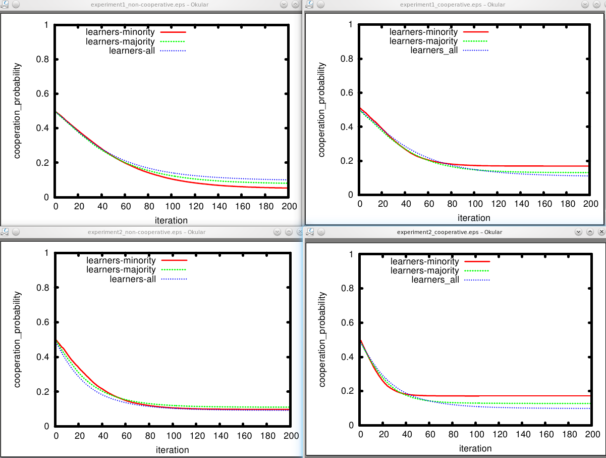
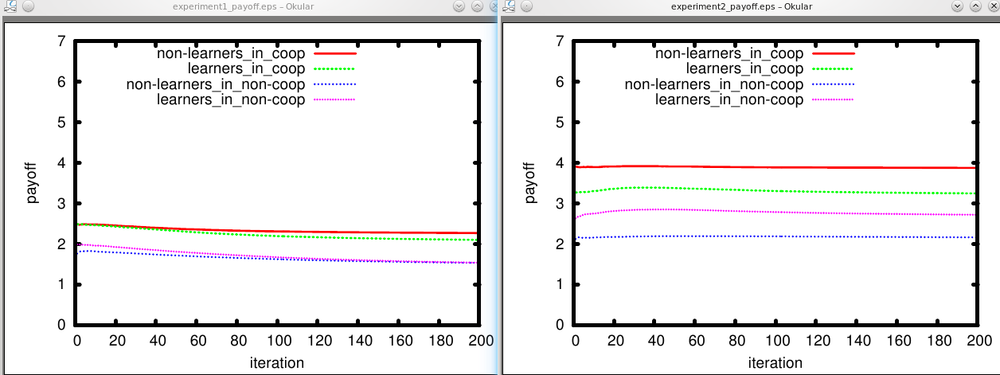

.. _sub_example:

Using subexperiments
====================

Summary
-------
In this example, we use sub-experiments and plot different parts of
the data set against each other.

Describing Subexperiments
-------------------------
To use subexperiments means that you have experiments of the same simulation 
that require some variables to be different from the others. 
There are often situations where this is a good approach.
Sometimes just because it structures your process, sometimes for technical
reasons. We use a good example for a technical reason here: Two experiments
that use different implementations of the `Prisoners Dilemma
<http://en.wikipedia.org/Prisoner's_Dilemma>`_. Such a dilemma is described by
four variable settings and here, we do not want all of the possible combinations 
between the two dilemmas (4*4=16). We want only two combinations - 
the two dilemmas.

To describe subexperiments, you can have some more ``.conf`` files next to ``experiment.conf``, one for each experiment.
In those, you can specify variable settings that only hold in those experiments (subexperiments inherit
settings from the main configuration `experiment.conf <http://www.assembla.com/code/nicessa/subversion/nodes/trunk/examples/subexp/experiment.conf>`_ and their settings overwrite
settings there. The *subexp* example mentions its subexperiments in
``experiment.conf`` in a section called ``[experiments]``, like so:

.. literalinclude:: ../../examples/subexp/experiment.conf

.. note:: We als have some more variable settings than in the basic example.
          ``n`` is the number of agents, ``ratio_learning`` indicates how many agents
          will change their likelihood to cooperate based on their experiences and
          ``mean_coop`` is the mean likelihood to cooperate of the
          (non-learning) agents.
          Have a look in `the executable for this experiment
          <http://www.assembla.com/code/nicessa/subversion/nodes/trunk/examples/subexp/main.py>`_ to see what the experiment is doing
          exactly. Basically, we are interested in the likelihood to
          cooperate which the learning agents will arrive at (they start
          at around 0.5).
          The second dilemma (in exp2.conf) is technically not a Prisoners Dilemma.
          I just played with the numbers to see how the very very simple 
          learning algorithm I used behaves when in the dilemma temptation
          and reward (as well as penalty and suckers' payoff) are the same. 

In this case, we need to provide the configuration files
`exp1.conf <http://www.assembla.com/code/nicessa/subversion/nodes/trunk/examples/subexp/exp1.conf>`_ and 
`exp2.conf <http://www.assembla.com/code/nicessa/subversion/nodes/trunk/examples/subexp/exp2.conf>`_. Note that we left out the
``.conf``-extension when we mentioned them.

In the subexperiments, we define a unique subset of settings in their own ``[vars]`` - section.
This is where we describe the different outcomes of interactions (payoff-wise) 
in our two versions of the Prisoner's Dilemma.

We can also give each experiment an own name and name a new maintainer for each
subexperiment.

Here is the configuration (figures left out for now) in exp1.conf:

.. literalinclude:: ../../examples/subexp/exp1.conf
    :lines: 1-8

And here is exp2.conf:

.. literalinclude:: ../../examples/subexp/exp2.conf
    :lines: 1-9

To make it clear: It does not appear any different to your executable if a variable setting is defined in one configuration file 
or the other. If you specified a comma-separated list of options in experiment.conf or in a subexperiment config, 
your executable code will get one config-file with all variables available in
the ``vars`` section (the configuration file for each setting is also put into the subfolder in the ``data`` dir). 
You only need to know that settings in the experiment configuration files overwrite
the general settings in the main configuration file.

This is where I think Nicessa makes your life easier :)

Running
--------

Let's run this thing. This is the output I get::

    nic@fidel:/media/data/projects/nicessa/trunk/examples/subexp$ nicessa . --run
    ********************************************************************************
    Running experiment Subexperiment Example
    ********************************************************************************

    ********************************************************************************
    [Nicessa] Running jobs on cpu 1 of server fidel

    [Nicessa] Processing 1/12 
    (section exp1_mean_coop0.2_n100_epochs200_pd_t5_ratio_learning0.25_pd_p1_pd_s0_pd_r3)
    . . . . . . . . . . . . . . . . . . . .
    [Nicessa] Processing 2/12 
    (section exp2_mean_coop0.2_n100_epochs200_pd_t10_ratio_learning0.75_pd_p1_pd_s0_pd_r5)
    . . . . . . . . . . . . . . . . . . . .
    [Nicessa] Processing 3/12 
    (section exp2_mean_coop0.2_n100_epochs200_pd_t10_ratio_learning1_pd_p1_pd_s0_pd_r5)
    . . . . . . . . . . . . . . . . . . . .
    [Nicessa] Processing 4/12 
    (section exp2_mean_coop0.8_n100_epochs200_pd_t10_ratio_learning0.25_pd_p1_pd_s0_pd_r5)
    . . . . . . . . . . . . . . . . . . . .
    [Nicessa] Processing 5/12 
    (section exp2_mean_coop0.8_n100_epochs200_pd_t10_ratio_learning1_pd_p1_pd_s0_pd_r5)
    . . . . . . . . . . . . . . . . . . . .
    [Nicessa] Processing 6/12 
    (section exp2_mean_coop0.2_n100_epochs200_pd_t10_ratio_learning0.25_pd_p1_pd_s0_pd_r5)
    . . . . . . . . . . . . . . . . . . . .
    [Nicessa] Processing 7/12 
    (section exp1_mean_coop0.2_n100_epochs200_pd_t5_ratio_learning0.75_pd_p1_pd_s0_pd_r3)
    . . . . . . . . . . . . . . . . . . . .                                  
    [Nicessa] Processing 8/12                                                  
    (section exp1_mean_coop0.8_n100_epochs200_pd_t5_ratio_learning0.25_pd_p1_pd_s0_pd_r3)
    . . . . . . . . . . . . . . . . . . . .                        
    [Nicessa] Processing 9/12                                                          
    (section exp2_mean_coop0.8_n100_epochs200_pd_t10_ratio_learning0.75_pd_p1_pd_s0_pd_r5)
    . . . . . . . . . . . . . . . . . . . .  
    [Nicessa] Processing 10/12 
    (section exp1_mean_coop0.2_n100_epochs200_pd_t5_ratio_learning1_pd_p1_pd_s0_pd_r3) 
    . . . . . . . . . . . . . . . . . . . .                      
    [Nicessa] Processing 11/12                                                                                        
    (section exp1_mean_coop0.8_n100_epochs200_pd_t5_ratio_learning1_pd_p1_pd_s0_pd_r3)  
    . . . . . . . . . . . . . . . . . . . .            
    [Nicessa] Processing 12/12                                                                                                           
    (section exp1_mean_coop0.8_n100_epochs200_pd_t5_ratio_learning0.75_pd_p1_pd_s0_pd_r3)       
    . . . . . . . . . . . . . . . . . . . .                                                                                                
    ********************************************************************************   

You will have noticed that the name of each configuration is outputted and for every run on it there is a dot.

Afterwards, you'll find that the subfolders of the ``examples/subexp/data`` directory will now also carry the experiment name.
This is the listing of that directory after the experiment is run::

    nic@fidel:/media/data/projects/nicessa/trunk/examples/subexp$ ls data
    exp1_mean_coop0.2_n100_epochs200_pd_t5_ratio_learning0.25_pd_p1_pd_s0_pd_r3  exp2_mean_coop0.2_n100_epochs200_pd_t10_ratio_learning0.25_pd_p1_pd_s0_pd_r5
    exp1_mean_coop0.2_n100_epochs200_pd_t5_ratio_learning0.75_pd_p1_pd_s0_pd_r3  exp2_mean_coop0.2_n100_epochs200_pd_t10_ratio_learning0.75_pd_p1_pd_s0_pd_r5
    exp1_mean_coop0.2_n100_epochs200_pd_t5_ratio_learning1_pd_p1_pd_s0_pd_r3     exp2_mean_coop0.2_n100_epochs200_pd_t10_ratio_learning1_pd_p1_pd_s0_pd_r5
    exp1_mean_coop0.8_n100_epochs200_pd_t5_ratio_learning0.25_pd_p1_pd_s0_pd_r3  exp2_mean_coop0.8_n100_epochs200_pd_t10_ratio_learning0.25_pd_p1_pd_s0_pd_r5
    exp1_mean_coop0.8_n100_epochs200_pd_t5_ratio_learning0.75_pd_p1_pd_s0_pd_r3  exp2_mean_coop0.8_n100_epochs200_pd_t10_ratio_learning0.75_pd_p1_pd_s0_pd_r5
    exp1_mean_coop0.8_n100_epochs200_pd_t5_ratio_learning1_pd_p1_pd_s0_pd_r3     exp2_mean_coop0.8_n100_epochs200_pd_t10_ratio_learning1_pd_p1_pd_s0_pd_r5

Plotting with reduced data-sets
--------------------------------

With all the data we have, we also should make some figures to look at - 
we'll use our variable settings to plot different data sets, such that we can 
meaningfully compare the outcomes of different settings.

Figure 1 shows likelihood to cooperate of learners when the non-learners form a
cooperative environment (``mean_coop:0.8``) and Figure 2 does this in a
non-cooperative environment (``mean_coop:0.2``). Figure 3 shows payoffs of
everyone in both environments.

Figure descriptions can also be put in the subexperiment's config files.
This should help to keep bigger projects a bit structured (just start numbering at 1 in each file).

This is from exp1.conf: 

.. literalinclude:: ../../examples/subexp/exp1.conf
    :lines: 10-

This is from exp2.conf: 

.. literalinclude:: ../../examples/subexp/exp2.conf
    :lines: 11-

Here are the plots we get - Since we use only line plots, all data was averaged.
First the probability to cooperate:

And the payoffs the agents got:

.. note:: Again, the example is here to show you functionality rather than to convey
        scientific value :) However, we can see in experiment 1 that - using our
        simple learning behaviour - cooperation decreases heavily among learners, 
        no matter if they started in a cooperative or non-cooperative environment, 
        or if learners were in the majority or not - 
        and they are not able to extract higher profits
        overall. 
        This is different when the dilemma is not really a Prisoners Dilemma,
        but reward and temptation are the same. Cooperation started arounf 0.5
        and basically stays the same. However, there is an interesting bump
        at the beginning of the simulation ...

